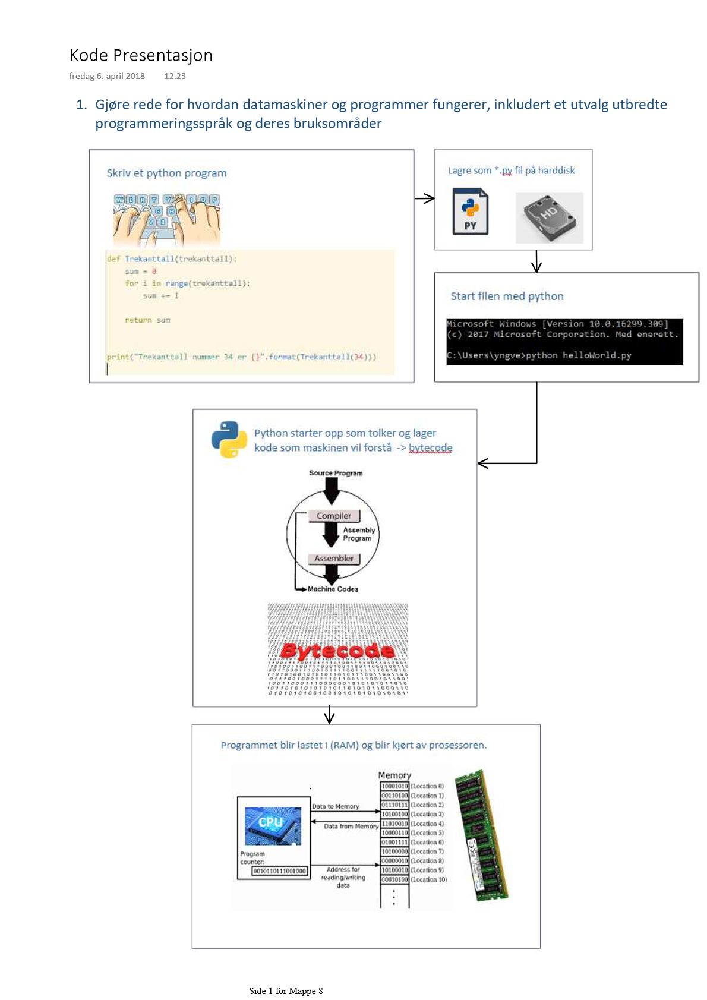

### 1. Hva er programmering?

Programmering er prosessen med å skrive instruksjoner som en datamaskin kan forstå og utføre. Disse instruksjonene, eller kodene, er skrevet i programmeringsspråk som Python, Java, eller C++. Programmering gir oss muligheten til å løse problemer, automatisere oppgaver, bygge applikasjoner, og skape verktøy som kan utføre spesifikke funksjoner. I essens er programmering en måte å fortelle datamaskinen hva den skal gjøre ved å gi den presise og sekvensielle instruksjoner. [[1. Hva er programmering]]

### 2. Hva er et program?

Et program er en samling av koder eller instruksjoner skrevet i et programmeringsspråk som utfører en spesifikk oppgave når det blir kjørt av en datamaskin. Det kan være alt fra en enkel kalkulator som utfører grunnleggende matematiske operasjoner, til komplekse applikasjoner som kontrollerer industrielle maskiner eller driver sosiale medieplattformer. Programmets formål er å løse et bestemt problem eller automatisere en oppgave ved å utføre de trinnvise instruksjonene som er kodet inn i det.

### 3. Hvordan fungerer et program?

Et program fungerer ved at det leses og utføres av en datamaskinens prosessor. Når et program blir startet, blir instruksjonene det inneholder behandlet en etter en, fra toppen av programmet til slutten, eller til en bestemt betingelse er oppfylt. Hver instruksjon utføres i rekkefølge, noe som gir programmet sin funksjonalitet. For eksempel kan et program ta imot data fra brukeren, prosessere disse dataene ved hjelp av logikk og operasjoner, og deretter vise resultatene. Dette skjer raskt, på grunn av datamaskinens evne til å utføre millioner av instruksjoner per sekund.

### 4. Programmering i Python?

Python er et høynivå, tolket programmeringsspråk som er kjent for sin enkelhet og lesbarhet. Dette gjør det til et populært valg for både nybegynnere og erfarne utviklere. Python støtter flere programmeringsparadigmer, inkludert objektorientert, funksjonell, og prosedyrel programmering. Det er et allsidig språk som brukes i en rekke applikasjoner, fra webutvikling og dataanalyse til kunstig intelligens og automatisering. Med sitt omfattende bibliotek av moduler og verktøy, gir Python utviklere muligheten til raskt å bygge og implementere funksjonelle programmer. Programmering i Python innebærer å skrive koder i en enkel, konsis syntaks som gjør det lettere å fokusere på å løse problemer snarere enn å kjempe med språklige detaljer.

